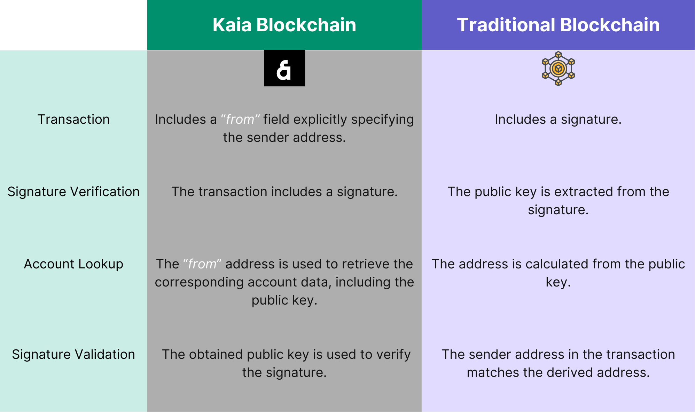
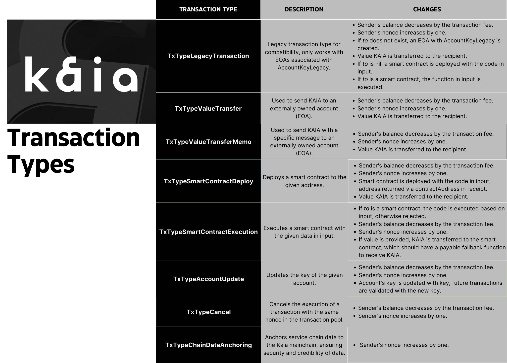
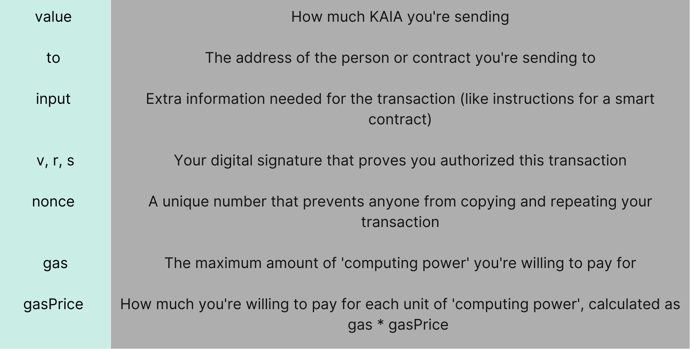
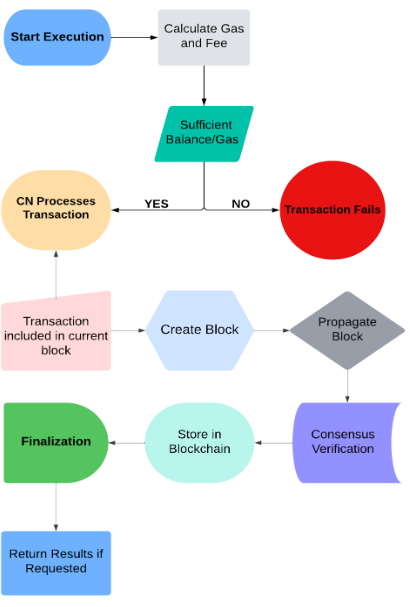
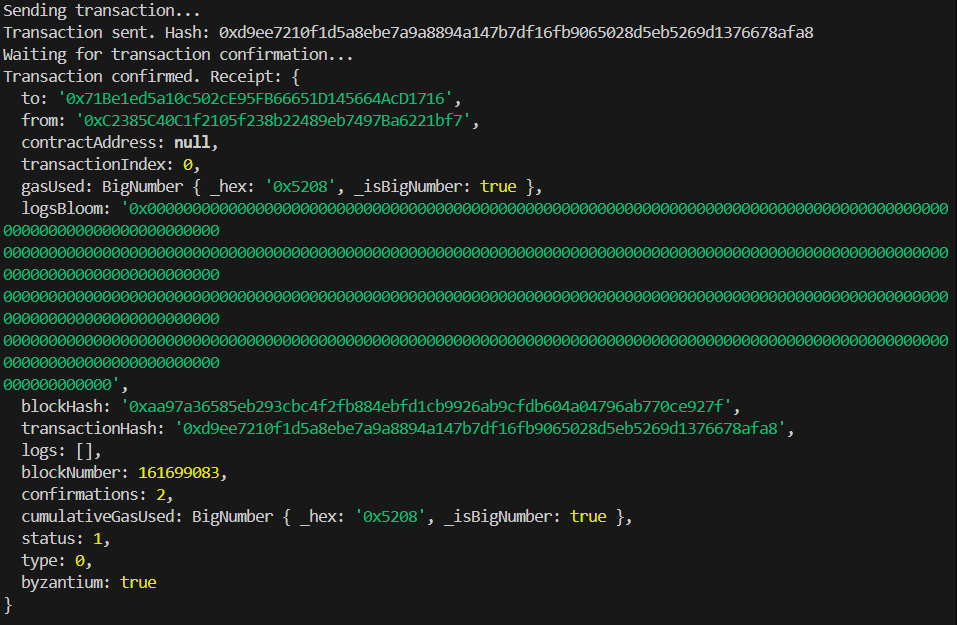

# **Kaia's Transaction Lifecycle**

Kaia's blockchain platform introduces a novel approach to transaction processing, providing enhanced flexibility, performance, and optimizations compared to traditional blockchain platforms. This article explores the lifecycle of a transaction on the Kaia platform, detailing the transaction components, signature validation, fee delegation, and the various types of transactions supported.

Before we go into the details of Kaia's transaction model, it's important to first understand how traditional blockchain systems operate.

#### **Understanding Address and Key Pair Decoupling in Kaia**

In conventional blockchain systems, there is a tight link between an address and its corresponding public key, typically established through cryptographic hashing. In these systems, a typical transaction includes a signature from which the public key is derived during the verification process. The address is then calculated from this public key, and validation occurs by ensuring the sender address in the transaction matches the derived address.

Kaia, however, disrupts this model by introducing a decoupled approach that separates the address from the public key. In Kaia's system, the transaction explicitly specifies the sender address in a '_from_' field. While the transaction still includes a signature, the verification process follows a different path. Instead of deriving the address from the signature, Kaia uses the '_from_' address to retrieve the corresponding account data, which contains the public key.



This key is then used to verify the signature, offering a more flexible and adaptable system for managing addresses and keys.



With this foundational understanding, we can now explore the different types of transactions supported on the Kaia platform.

## **Transaction Creation**

A transaction on Kaia begins when a user or application initiates an action that requires a change in the blockchain state. This could involve a token transfer, a smart contract interaction, or any other operation supported by Kaia. Key components of a Kaia transaction include the sender's address, the recipient's address (if applicable), the transaction amount (for value transfers), gas limit and price, nonce (transaction count for the sender's address), payload (data for smart contract interactions), and signature.



Once a transaction is created, it is broadcast to the Kaia network, involving its transmission to multiple nodes to ensure redundancy and fault tolerance. These nodes receive the transaction and store it in their transaction pools, which serve as temporary holding areas for pending transactions.

## **Transaction Submission**

After a transaction is created, it is submitted to the Kaia network, triggering a complex process of propagation and validation. This submission typically begins with sending the transaction to a single Kaia node, which acts as an entry point into the broader network. Upon receiving the transaction, the initial node performs preliminary checks to ensure the transaction’s basic validity, such as verifying its correct format and the sender’s signature.

Once these initial checks are passed, the node plays a crucial role in propagating the transaction to other nodes across the Kaia network. This propagation occurs through a gossip protocol, where each node shares the transaction with a subset of its connected peers. These peers then share it with their own peers, creating a ripple effect that rapidly disseminates the transaction across the network while minimizing congestion.

As the transaction spreads throughout the network, it enters a state known as the **_mempool_**, or memory pool. The mempool is a critical component of the Kaia network, functioning as a temporary holding area for unconfirmed transactions. Each node maintains its own mempool, which can be thought of as a waiting room for transactions that have been validated but not yet included in a block.

Within the mempool, transactions are usually ordered by their gas price, with higher-priced transactions receiving priority. This creates an efficient market mechanism where users can potentially expedite their transaction processing by offering higher gas prices. However, it is important to note that being in the mempool does not guarantee that a transaction will be processed, especially during periods of high network activity when the mempool may become full.

Consensus nodes, responsible for creating new blocks, select transactions from their mempools to include in the next block. Typically, they prioritize transactions with higher gas prices to maximize their rewards. Once a transaction is included in a block and the block is added to the blockchain, the transaction is removed from the mempool of all nodes that receive the new block.

This entire process—from submission to propagation to mempool storage—happens rapidly, often within seconds. However, the time a transaction spends in the mempool can vary significantly depending on network congestion and the gas price offered. This system enables Kaia to efficiently manage a high volume of transactions while maintaining network integrity and giving users some control over the speed at which their transactions are processed.

## **Transaction Validation**

Before a transaction can be executed on the Kaia blockchain, each node performs a series of initial validation checks. These checks ensure that the transaction is correctly formatted and structured, the signature is valid, the sender has sufficient balance to cover the gas fees, and the nonce value is appropriate. If any of these criteria are not met, the transaction is rejected and does not enter the **_mempool_**.

Once a transaction passes these validation checks, it is added to each node's transaction pool. This pool acts as a buffer, allowing nodes to gather transactions before selecting them for inclusion in a block. The selection process prioritizes transactions based on factors like gas price, transaction fee, and other relevant mechanisms, ensuring that the network remains efficient and secure.


## **Transaction Execution**

The Kaia blockchain employs a meticulous transaction execution process to uphold the network's security, integrity, and performance. This process begins with calculating gas and transaction fees, followed by processing transactions by Consensus Nodes (CNs), creating blocks, and finalizing the blockchain.

Each operation's gas consumption on the Kaia network is predefined, and the transaction fee, denominated in Kaia's native cryptocurrency (KAIA), is calculated based on the gas consumed and a unit price multiplier. If the sender's account lacks sufficient balance or gas, the transaction fails to execute.

Consensus Nodes play a critical role in executing transactions. They select executable transactions from their transaction pools and process them sequentially. Successfully executed transactions are included in the current block being created.

During block creation, CNs gather transactions until they reach the block's gas or time limit. The CN then completes the required fields for the block, such as the hash values of transactions, receipts, and the current state. A block hash is then generated to represent the complete block.

Once the block is finalized, it is propagated to all other CNs in the network, who verify the block and reach consensus using the BFT (Byzantine Fault Tolerance) consensus algorithm. Once a majority of nodes verify the block, it is permanently stored on the blockchain, ensuring the immutability and finality of the transactions.

Thanks to the BFT consensus algorithm, the block gains immediate finality as soon as consensus is reached, making it irreversible. At this stage, the execution results can be returned to the original transaction sender, if requested. This comprehensive transaction execution process highlights Kaia's commitment to providing a reliable and efficient platform for decentralized applications.



### **Smart Contract Lifecycle**

On the Kaia blockchain, smart contracts are deployed as transactions and reside at specific addresses on the network. These smart contracts can be interacted with through additional transactions, which incur gas fees based on the computational requirements of the contract's operations.

While smart contracts on Kaia cannot be deleted once deployed, the platform does offer a mechanism to disable them, similar to Ethereum's ‘_selfdestruct’_function. Moreover, Kaia is developing advanced mechanisms to enable the upgrade of deployed smart contracts, addressing the limitations of immutable code. This feature aims to provide a more flexible and adaptable environment for decentralized applications, ensuring that the platform evolves with the needs of its users.

### **Enhanced Randomness in Block Proposer and Committee Selection**

Kaia has implemented a unique mechanism to introduce verifiable on-chain randomness in the block proposer and committee selection processes. This mechanism involves adding two new fields in the block header: _randomReveal_and _mixHash_.

Block proposers in the Kaia network generate and commit to random values. The _randomReveal_field in a block contains the proposer's signature, calculated based on the current block number being proposed. The _mixHash_is then computed using this revealed random value and other block data, creating a source of randomness for the network.

This randomness is utilized in the block proposer and committee selection processes, making them more unpredictable and fair, thus enhancing the overall security of the network. One key benefit of this approach is that it allows block proposers to remain private until the previous block is completed, adding an extra layer of security to the network.

This execution flow creates a cycle where each block's randomness influences future block proposer and committee selections, introducing unpredictability while maintaining verifiability.

### **Restrictions on Transaction Execution and Smart Contract Deployment**

To optimize network performance and security, Kaia has implemented several restrictions on transaction execution and smart contract deployment:

1. **Transaction Execution:**
    * Gas price is set as a maximum, with the actual price determined by the network.
    * Transactions that exceed the computation cost limit are discarded.
    * An additional gas cost is applied for contract creation based on the length of the initcode.
2. **Smart Contract Deployment:**
    * Deployment of new contract code starting with the 0xEF byte is prohibited.
    * The initcode length cannot exceed 49,152 bytes.
    * The length of the new contract code cannot exceed 24,576 bytes.
    * Smart contract account (SCA) overwriting externally owned accounts (EOA) is enabled.

These restrictions ensure that the Kaia network operates efficiently and securely, balancing developers' needs with the overall system's performance and stability.

### **Practical Implementation Using Kaia-SDK**

To demonstrate the practical application of Kaia's transaction lifecycle, here’s an example of how to create and sign a transaction using the [kaia-sdk](https://github.com/kaiachain/kaia-sdk).

First, install the necessary dependencies:

Then, create a_transaction.js_ file in the root folder and write the following code:

```javascript
const ethers = require("ethers");
const { Wallet, JsonRpcProvider, TxType, parseKaia } = require("@kaiachain/ethers-ext");

const recieverAddr = "0x71be1ed5a10c502ce95fb66651d145664acd1716";
const senderAddr = "0xc2385c40c1f2105f238b22489eb7497ba6221bf7";
const senderPriv = "0x380b1b0b3d1568b68a68fecaf769ef647066998e756b6a4903291a891eb15fd8";

const provider = new JsonRpcProvider(
  "<https://public-en-kairos.node.kaia.io>"
);
const wallet = new Wallet(senderPriv, provider);

async function main() {
  try {
    const tx = {
      type: TxType.ValueTransfer,
      from: senderAddr,
      to: recieverAddr,
      value: parseKaia("0.1"),
    };

    console.log("Sending transaction...");
    const sentTx = await wallet.sendTransaction(tx);
    console.log("Transaction sent. Hash:", sentTx.hash);

    console.log("Waiting for transaction confirmation...");
    const receipt = await sentTx.wait();
    console.log("Transaction confirmed. Receipt:", receipt);
  } catch (error) {
    console.error("An error occurred:", error);
  }
}

main();
```

This example illustrates the difference between Kaia’s account model and traditional blockchains, reflected in the ‘_tx_’ object. You’ll notice the key ‘_type_’ with the value ‘_TxType.ValueTransfer_’, which specifies the transaction type. Unlike traditional blockchains that may not explicitly categorize transactions this way, Kaia uses ‘_TxType_’ to clearly define the nature of each transaction. In this case, ‘_TxType.ValueTransfer_’ indicates a transfer of KAIA tokens from one account to another, ensuring clarity and consistency in transaction processing.

Finally, run the script in your terminal:

```bash
node transaction.js
```

This should produce the following output:



This example showcases how developers can use the kaia-sdk to create, sign, and submit transactions, simplifying the complexities of interacting with the Kaia network. The SDK makes it easier for developers to build applications on the platform, leveraging Kaia's efficient transaction processing and consensus mechanisms.

You can check this [Github](https://github.com/jorshimayor/kaia_transaction) repository for details, also drop any questions on the Kaia Developers Discord group.

## **Conclusion**

Understanding Kaia's transaction lifecycle is not just an academic exercise but a critical knowledge base for developers building on the Kaia platform. By seamlessly integrating theory and practice, as demonstrated in the code example, Kaia offers a powerful and accessible blockchain solution.

The future of blockchain technology lies in platforms like Kaia, which bridge the gap between complex consensus mechanisms and user-friendly interfaces. As the ecosystem evolves, the ability to understand and implement these transaction lifecycles will be invaluable for developers looking to harness the full potential of blockchain technology.
